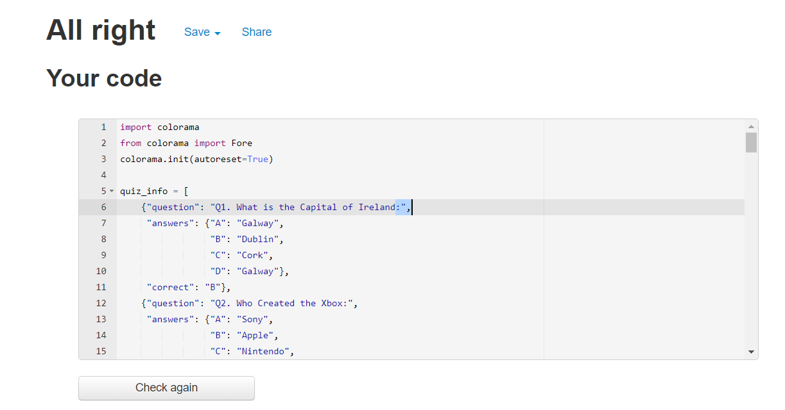
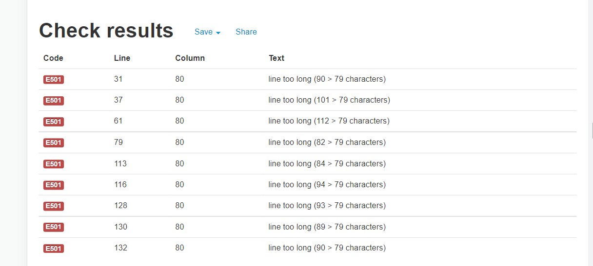
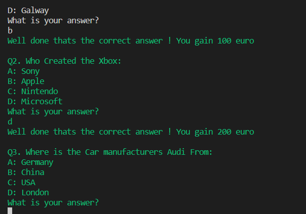

<h1 align="center"> The PP3 QUIZ</h1>

The Project is a general knowledge quiz game.

## How to play

* The User will be asked for their name
* The rules of the game will be giving to the user
* They will be asked do they want to continue with the game
* They will then answer questions with multiply choice answers
* If they answer correctly they gain 100euro to the pot
* If they answer wrong the cash remains the same
* There is a total of 10questions and they get harder for each one
* After the 10th question the total the user won is shown
* They have a choice to play again or to end the game.

## [Click here for the live game](https://pp3quiz.herokuapp.com/)

## User Experience (UX)

-   ### User stories

    -   #### First Time Visitor Goals

        1. As a First Time Visitor, I want to know the rules of the game 
        2. As a First Time Visitor, I want to play the game without any complications such as a typo in the answers.
         

    -   #### Returning Visitor Goals

        1. As a Returning Visitor, I want to play the game when i have free time.
        2. As a Returning Visitor, I want my improve on my skills and get a better score
        

# Testing and deploying project

### Testing thru the Pep8 website 

[Pep8](http://pep8online.com/) - I tested my Python code here for validation, displayed no errors.  
<h2 align="center"></h2>

## Created the Heroku app

* I started with creating a _Config Var_ called `PORT`, and set this to `8000` in my Heroku page.  

* I created the app using following steps:  
* I added two buildpacks from the _Settings_ tab. The ordering is as follows:

1. `heroku/python`
2. `heroku/nodejs`

* The importance here is to first have the Python, and after it the nodejs for it to work properly.

# Technologies used

* This project was made using only Python.  
* Code is written in gitpod.  
* This project has been deployed to Heroku.  

# Future additions.   

* If i had more time on the project there would be a few things i would do to make it more appealing to the user
* I would add a random question function so its not the same question all the time
* Do a game that mimics the television show "who wants to be a millionaire".
* Add a timer. 

# Errors and issues. 

* I had plenty of indented errors which was fixed by focusing a little more.
* pep8online was kind enough to tell me plenty of lines were too long, Which i resolved but i
think the code doesn't look as clean.
             <h2 align="center"></h2>

* I found it hard to loop through my questions and answers but with help of student support and Youtube I managed to loop through the questions, answers and the right answer.
* I imported the colorama library to style the answers. But i didnt know how to stop the coloring like the example below. I then discovered if i put "colorama.init(autoreset=True)" this will reset the color. 
            <h2 align="center"></h2>

# Credits and content

[Mike Dean](https://youtu.be/SgQhwtIoQ7o) - Mike Deans Video to help me understand the write out of the quiz.

[Geek Tutorials](https://youtu.be/myJ36xIR7Yg) - Geek Tutotrials also helped with my understanding.

[Travel with Ellie](https://travelswithelle.com/other/multiple-choice-trivia-questions/) - For some of the questions and answers.

[Realpython.com](https://realpython.com/python-quiz-application/) - For help looping through the questions. 

### 
# Acknowledgements

My Mentor for continuous helpful feedback.

Tutor support at Code Institute for their support.

The Teachers at Code Institude for helpful videos and the walk through project called Love Maths.

My collegues on the slack app who helped me when i had any issues.

This is a game for Project 3 for the Full Stack Software Developer program with Code Institute.  

 